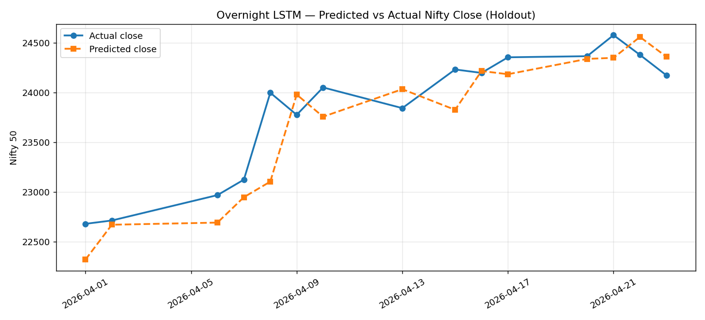
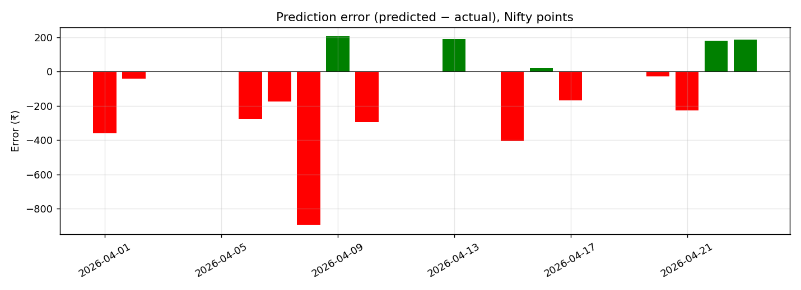

# Overnight Nifty LSTM — Holdout Report

**Model:** overnight_nifty_lstm (v1)
  
**Trained at:** 2026-04-24T19:23:41.185170Z
  
**Train window:** 2016-06-09 → 2026-03-30  
**Holdout window:** 2026-04-01 → 2026-04-23  (15 trading days)

## Headline numbers

| Metric | Value |
|---|---|
| Close MAE (% of price) | 1.023% |
| Close RMSE (% of price) | 1.332% |
| Direction accuracy (3-class) | 26.7% (random = 33.3%) |
| Directional accuracy (UP/DOWN only, ignoring FLAT predictions) | 26.7% on n=15 |
| Magnitude bucket accuracy (4-class) | 40.0% (random = 25%) |

## Direction confusion matrix

Rows = actual, Cols = predicted

```
predicted_direction  DOWN
actual_direction         
DOWN                    4
FLAT                    3
UP                      8
```

## Per-day predictions

| date       |   actual_close |   predicted_close |   abs_error_pct | predicted_direction   | actual_direction   | direction_correct   | predicted_magnitude   |   dir_confidence_pct |
|:-----------|---------------:|------------------:|----------------:|:----------------------|:-------------------|:--------------------|:----------------------|---------------------:|
| 2026-04-01 |        22679.4 |           22319.9 |           1.585 | DOWN                  | UP                 | False               | MEDIUM                |                 37.8 |
| 2026-04-02 |        22713.1 |           22670.4 |           0.188 | DOWN                  | FLAT               | False               | MEDIUM                |                 38.8 |
| 2026-04-06 |        22968.2 |           22691.8 |           1.204 | DOWN                  | UP                 | False               | MEDIUM                |                 42   |
| 2026-04-07 |        23123.7 |           22947.2 |           0.763 | DOWN                  | UP                 | False               | MEDIUM                |                 42.5 |
| 2026-04-08 |        23997.3 |           23103.8 |           3.723 | DOWN                  | UP                 | False               | MEDIUM                |                 42.2 |
| 2026-04-09 |        23775.1 |           23978.8 |           0.857 | DOWN                  | DOWN               | True                | MEDIUM                |                 41.2 |
| 2026-04-10 |        24050.6 |           23756.5 |           1.223 | DOWN                  | UP                 | False               | MEDIUM                |                 41.8 |
| 2026-04-13 |        23842.7 |           24033   |           0.798 | DOWN                  | DOWN               | True                | SMALL                 |                 42.3 |
| 2026-04-15 |        24231.3 |           23825.8 |           1.673 | DOWN                  | UP                 | False               | SMALL                 |                 42.1 |
| 2026-04-16 |        24196.8 |           24215.5 |           0.077 | DOWN                  | FLAT               | False               | SMALL                 |                 42.1 |
| 2026-04-17 |        24353.5 |           24183.5 |           0.698 | DOWN                  | UP                 | False               | SMALL                 |                 40.6 |
| 2026-04-20 |        24364.8 |           24337.5 |           0.112 | DOWN                  | FLAT               | False               | SMALL                 |                 41.2 |
| 2026-04-21 |        24576.6 |           24348.3 |           0.929 | DOWN                  | UP                 | False               | SMALL                 |                 41.3 |
| 2026-04-22 |        24378.1 |           24558.2 |           0.739 | DOWN                  | DOWN               | True                | MEDIUM                |                 41.7 |
| 2026-04-23 |        24173   |           24359.9 |           0.773 | DOWN                  | DOWN               | True                | MEDIUM                |                 41.7 |

## Plots

- 
- 
